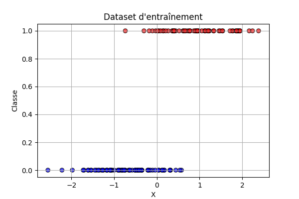
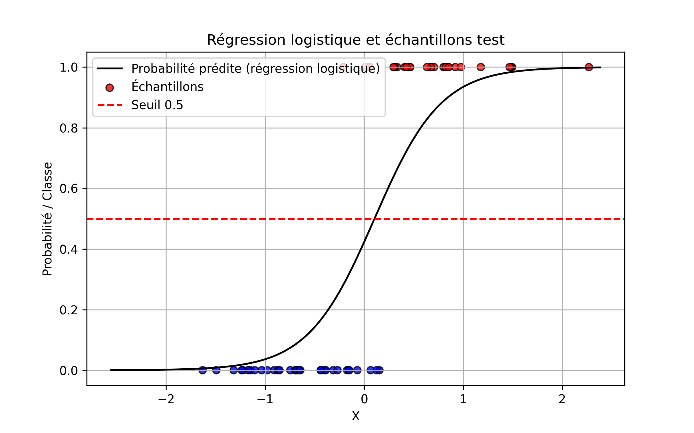

# 📚 Introduction aux courbes ROC

Dans ce document, nous allons comprendre **ce qu’est une courbe ROC**, **comment elle est construite**, et **comment l’interpréter**.  
Nous allons utiliser des **exemples visuels** simples, issus d’un dataset artificiel, pour rendre les concepts plus concrets.

---

# 1. Création d’un dataset simple

Pour commencer, nous avons généré un jeu de données simple :  
- Chaque point est caractérisé par une seule variable \(X\).
- Les étiquettes \(y\) prennent la valeur **0** ou **1**.
- Les couleurs indiquent la classe réelle : **bleu pour 0**, **rouge pour 1**.

**Objectif :** entraîner un modèle capable de prédire la probabilité qu’un point appartienne à la classe 1.

---

# 2. Régression logistique sur les données

Nous utilisons une **régression logistique** pour modéliser la probabilité d’appartenance à la classe 1.  
La courbe noire représente la **fonction de prédiction** : plus un point est à droite, plus sa probabilité d'être de classe 1 augmente.

Les **points colorés** montrent nos échantillons de test.  
Le **seuil de décision** est fixé à **0.5** :  
- Si la probabilité prédit plus que 0.5 → classe 1.
- Sinon → classe 0.

---

# 3. L'importance du choix du seuil

Selon le **seuil choisi**, le comportement du modèle change :

- **Seuil 0.3** : le modèle est très optimiste → il prédit plus souvent la classe 1.
- **Seuil 0.5** : équilibre par défaut.
- **Seuil 0.7** : le modèle devient plus conservateur → il faut être très sûr pour prédire 1.

👉 **Changer le seuil impacte directement le compromis entre faux positifs et faux négatifs.**

---

# 4. Introduction à la courbe ROC

Une **courbe ROC** (Receiver Operating Characteristic) représente **la performance du modèle pour tous les seuils possibles**.

Sur cette figure :
- L’axe **x** est le **taux de faux positifs** (FPR).
- L’axe **y** est le **taux de vrais positifs** (TPR).

Chaque point de la courbe correspond à un **seuil de décision différent** :
- Un modèle parfait aurait une courbe qui monte directement en haut à gauche.
- Un modèle aléatoire suit la diagonale (ligne pointillée).

**Astuces de lecture :**
- Plus la courbe est proche du coin supérieur gauche, meilleur est le modèle.
- L’**AUC** (Area Under Curve) mesure la surface sous la courbe ROC : plus elle est proche de 1, mieux c’est.

---

# 5. Comment calcule-t-on une courbe ROC ?

La méthode est simple :
1. **Classer** les exemples par probabilité décroissante.
2. **Balayer tous les seuils possibles** (de 1 à 0).
3. À chaque seuil, calculer :
   - **TPR** (True Positive Rate) = Vrais positifs / (Vrais positifs + Faux négatifs)
   - **FPR** (False Positive Rate) = Faux positifs / (Faux positifs + Vrais négatifs)
4. Tracer **TPR** en fonction de **FPR**.

---

# 6. Comparaison de plusieurs modèles

Sur cette figure, nous comparons :
- Notre modèle réel (courbe bleue)
- Un modèle parfait (courbe verte : AUC = 1)
- Un modèle aléatoire (courbe orange : AUC ≈ 0.5)

**On observe que** :
- Notre modèle est **meilleur qu’un tirage aléatoire**.
- Il est cependant **loin de la perfection** (ce qui est normal sur des données bruitées).

---

# 7. Bonus : Courbe Precision-Recall

Une autre manière d’évaluer les performances est d’utiliser la **courbe Précision-Rappel**, particulièrement utile si :

- Les classes sont **déséquilibrées**.
- On veut maximiser la **précision** ou le **rappel** selon l’application.

---

# 📈 Résumé : Pourquoi utiliser une courbe ROC ?

- Elle permet d’évaluer **l'impact du seuil** sans en choisir un arbitrairement.
- Elle montre **l'équilibre entre sensibilité et spécificité**.
- Elle est **indépendante du seuil choisi**.
- L'**AUC** donne un indicateur synthétique de qualité.

👉 La courbe ROC est un outil **fondamental** pour comparer objectivement des modèles de classification binaire.

---

# ✅ Conclusion

En utilisant un dataset simple et des visualisations progressives, nous avons vu :
- Comment un modèle de classification produit des probabilités.
- Comment le seuil de décision impacte les erreurs.
- Comment la courbe ROC représente la performance globale du modèle.

**La courbe ROC est un allié précieux pour comprendre, ajuster, et comparer nos modèles !**
